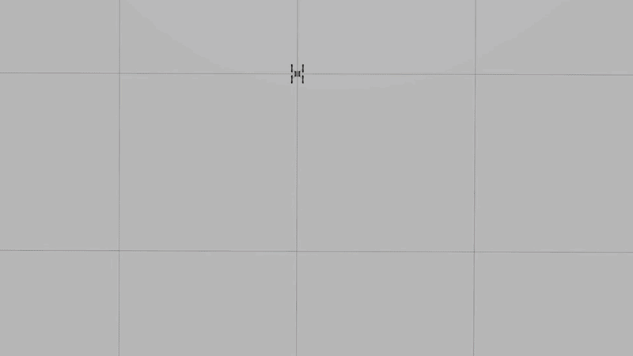

<div align="center">

# CrazyFlie Control

[](https://docs.ros.org/en/humble/index.html)
&nbsp;&nbsp;
[](https://gazebosim.org/docs/harmonic/getstarted/)
&nbsp;&nbsp;
[](https://python.org)
&nbsp;&nbsp;
[](https://docs.docker.com/)

A Crazyflie drone simulation running inside Gazebo, controlled via ROS 2. The drone takes off, hovers, then follows a figure-8 (well, kind of) trajectory using a PD position and attitude controller.



</div>

## Stack

- ROS 2 Humble
- Gazebo Harmonic
- Docker (Ubuntu, WSL2 on Windows)

## Setup

Open the project in VS Code and reopen in container. Then:

```bash
cd /home/developer/ros2_ws
source ./setup.sh <your_unique_id>
./build.sh
source install/setup.bash
```

## Running

Before running anything, when terminal is first created we need to run:

```bash
source install/setup.bash
```

```bash
# Terminal 1 - simulation
ros2 launch ros_gz_crazyflie_bringup crazyflie_simulation.launch.py

# Terminal 2 - mixer
ros2 run cf_control mixer

# Terminal 3 - your controller
cd /home/developer/ros2_ws/src/my_controller
python3 drone_controller.py
```

The control interface is `/cf_control/control_command` - publish collective thrust and torque there.
